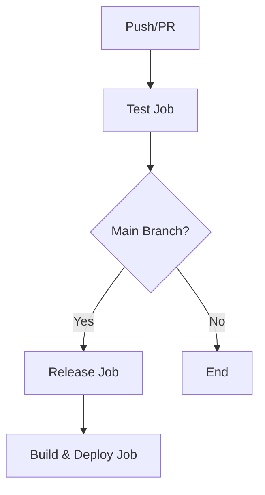

# CI/CD Pipeline Documentation

This document describes the continuous integration and deployment pipeline for the Quvis quantum visualization application.

## Pipeline Overview

The CI/CD pipeline consists of three main jobs that run on different triggers:



## Jobs Description

### 1. Test Job ✅
- **Triggers**: All pushes to main branch and all pull requests to main
- **Purpose**: Ensure code quality and prevent regressions
- **Actions**:
  - Checkout code
  - Set up Node.js 20.x
  - Install dependencies (`npm ci`)
  - Run unit tests with coverage (`npm run test:coverage`)
  - Upload test results and coverage reports as artifacts

**Coverage Thresholds**:
- Functions: 70%
- Branches: 70%
- Lines: 70%
- Statements: 70%

### 2. Release Job 🚀
- **Triggers**: Only pushes to main branch (not PRs)
- **Dependencies**: Requires test job to pass
- **Purpose**: Automated semantic versioning and releases
- **Actions**:
  - Semantic release based on commit messages
  - Update package.json version
  - Update UI version display
  - Create Git tags
  - Commit version changes back to main

### 3. Build & Deploy Job 🌐
- **Triggers**: Only pushes to main branch (not PRs)
- **Dependencies**: Requires both test and release jobs to pass
- **Purpose**: Deploy to GitHub Pages
- **Actions**:
  - Build TypeScript and Vite application
  - Deploy to GitHub Pages environment

## Branch Protection

### Pull Requests
- ✅ Tests must pass before merging
- ❌ No deployment (build & deploy skipped)
- ❌ No releases (release job skipped)

### Main Branch
- ✅ Tests run on every push
- ✅ Automatic releases on successful tests
- ✅ Automatic deployment to GitHub Pages

## Test Coverage

The pipeline generates comprehensive test coverage reports:

- **Text output**: Displayed in CI logs
- **JSON report**: For programmatic analysis
- **HTML report**: Visual coverage report
- **Artifacts**: Uploaded and retained for 7 days

### Current Coverage
As of the initial setup:
- **Heatmap.ts**: 40.11% statement coverage (LOD functions fully tested)
- **Overall**: 2.26% (expected, as only one component is tested)

## Failure Scenarios

### Test Failures
- ❌ Pipeline stops at test job
- ❌ No release or deployment
- ❌ PR cannot be merged until tests pass

### Coverage Threshold Failures
- ❌ Pipeline fails if coverage drops below 70%
- ⚠️ Can be adjusted in `vite.config.ts` if needed

### Release Failures
- ❌ No deployment if release fails
- ✅ Tests still provide feedback

## Commands for Local Development

```bash
# Run tests in watch mode
npm test

# Run tests once
npm run test:run

# Run tests with coverage
npm run test:coverage

# Run tests with UI
npm run test:ui
```

## Artifacts

The pipeline generates the following artifacts:

- **test-results**: Contains coverage reports
- **Retention**: 7 days
- **Location**: Available in GitHub Actions run details

## Best Practices

1. **Write tests before merging**: Ensure new features have adequate test coverage
2. **Check coverage locally**: Run `npm run test:coverage` before pushing
3. **Meaningful commit messages**: Use conventional commits for proper semantic releases
4. **Review test results**: Check artifacts for detailed coverage reports

## Monitoring

### Success Indicators
- ✅ All tests pass
- ✅ Coverage thresholds met
- ✅ Successful deployment to GitHub Pages

### Failure Indicators
- ❌ Test failures in PR checks
- ❌ Coverage below thresholds
- ❌ Deployment failures

## Future Enhancements

Consider adding:
- **Performance testing**: Benchmark critical rendering functions
- **E2E testing**: Full user journey testing
- **Visual regression testing**: Screenshot comparisons
- **Security scanning**: Dependency vulnerability checks
- **Code quality gates**: Additional linting and formatting checks 